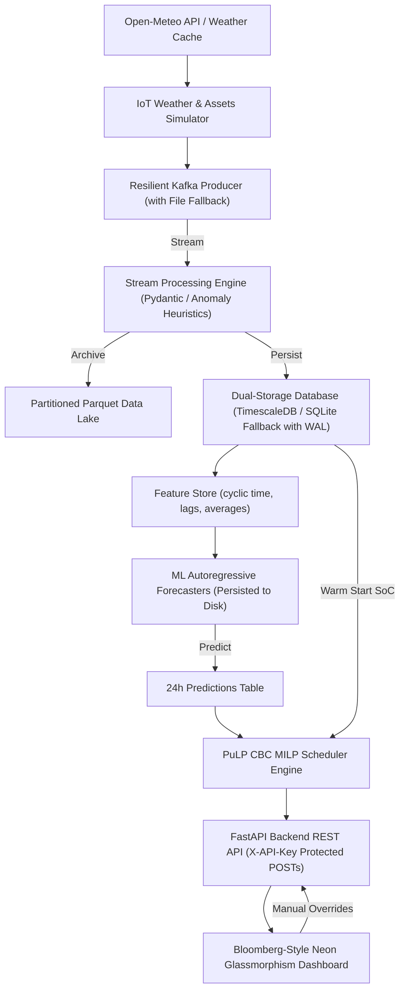

# 🔋 GridMind: Enterprise Microgrid Management & Optimization Platform

**Author**: Mohibul Hoque  
**Email**: [hokworks@gmail.com](mailto:hokworks@gmail.com)  
**LinkedIn**: [linkedin.com/in/speedymohibul](https://linkedin.com/in/speedymohibul)  

GridMind is an end-to-end, resilient IoT microgrid analytics and control system. It integrates live weather forecasting (Open-Meteo), physical solar/wind modeling, real-time Kafka event streaming, data validation, ML-based forecasting, Mixed-Integer Linear Programming (MILP) battery dispatch scheduling, and a premium real-time control center dashboard.

---

## 🏗️ System Architecture



---

## 🚀 Key Features

* **IoT Environmental Simulation**: Physical models of Solar PV, Wind Turbines, Campus smart meters, and Battery banks driven by real-world weather metrics.
* **Resilient Messaging Bus**: Telemetry producer streams to Kafka with an automatic file backup (`dead_letter_queue.log`) if the broker goes offline.
* **Validation & Anomaly Tracking**: Telemetry records are validated against strict Pydantic schemas, checking for frozen sensors, safety spikes, and missing values.
* **Dual-Storage Engine**: Connects to Postgres/TimescaleDB with an automatic local SQLite fallback. Database writes feature WAL mode and busy timeouts to prevent lockups.
* **Machine Learning Pipelines**: HistGradientBoosting and RandomForest regressors estimate future demand, wind, solar, and spot prices, Retraining on fresh database metrics.
* **MILP Battery Dispatch Optimizer**: Mixed-Integer Linear Programming engine (PuLP) dynamically minimizes net grid costs using live database SoC states and cyclic price forecasts, backed by a 5-minute schedule cache.
* **Protected Web API**: FastAPI service protected by `X-API-Key` headers for control commands and simulation triggers.
* **Bloomberg-Style Dashboard**: Sleek, glassmorphism dashboard featuring real-time KPI card updates, live-clock widget, historical flow series, and optimal dispatch charts with AbortController poll guards.

---

## 🛠️ Setup & Prerequisites

### 1. Requirements
* **Python** `>= 3.11`
* **uv** (Recommended package manager)
* **Docker & Docker Compose** (For Zookeeper and Kafka)

### 2. Dependency Installation
Initialize the environment and download python dependencies:
```bash
uv sync
```

### 3. Messaging Bus Setup
Start the Zookeeper and Kafka broker containers in the background:
```bash
docker-compose -f docker/docker-compose.yml up -d
```

---

## 🖥️ Command Execution Guide

### 1. IoT Simulator CLI (`run_sim.py`)
Run the IoT simulator to print live telemetry steps. Add `--stream-kafka` to publish to the broker:
```bash
uv run python -m src.simulator.run_sim --steps 24 --interval 1.0
```

### 2. Stream Processor & Data Lake Ingestor (`validator.py`)
Validate incoming stream events, partition clean metrics into the Parquet data lake, and commit records to relational storage:
```bash
uv run python -m src.streaming.validator --source kafka
```

### 3. Replay DLQ Backups (`db_writer.py`)
Replay the local backup DLQ logs back into active storage:
```bash
uv run python -m src.storage.db_writer --source file --file-path data/dead_letter_queue.log
```

### 4. ML Forecaster Pipeline (`forecaster.py`)
Manually run model training, output performance statistics, and generate future 24h prediction forecasts:
```bash
uv run python -m src.analytics.forecaster
```

### 5. Launch FastAPI Backend Service (`main.py`)
Launch the REST API server natively on port 8000:
```bash
uv run uvicorn src.api.main:app --host 127.0.0.1 --port 8000
```
Open **[http://127.0.0.1:8000/static/index.html](http://127.0.0.1:8000/static/index.html)** in your browser to view the control center dashboard.

---

## 🔑 REST API Interface

| Method | Endpoint | Description | Auth Required |
| :--- | :--- | :--- | :--- |
| **GET** | `/health` | Server wellness check | No |
| **GET** | `/api/status` | Current telemetry KPI snapshot | No |
| **GET** | `/api/metrics/historical` | Retrieves historical data lists for dashboard charts | No |
| **GET** | `/api/schedule` | Generates or fetches cached MILP optimal dispatch schedule | No |
| **POST** | `/api/control/override` | Enforces battery manual charge/discharge override rate | **Yes** (`X-API-Key`) |
| **POST** | `/api/live-update` | Programmatic step simulation tick | **Yes** (`X-API-Key`) |

---

## 🧪 Running Automated Tests
Run the entire unit and integration test suite to verify physical models, database schema fallbacks, ML data seeding, PuLP solver constraints, and endpoint security:
```bash
uv run pytest
```

---

## 🔒 Enterprise Audits & Mitigations
This project underwent a comprehensive audit and implementation cycle resolving 18 architectural, logical, and design flaws:
1. **Dynamic SoC Solver Warm-Starting**: Replaced hardcoded optimizer SoC with live database telemetry.
2. **Self-Healing Predictions**: Auto-triggers ML forecaster if forecast rows are stale or missing.
3. **Historical Battery flow series**: Visualizes live battery flows inside dashboard charts.
4. **Data Scarcity Auto-Seed**: Seeds 168 rows of simulation history automatically if training data is too small.
5. **MILP Solver Caching**: Added a 5-minute TTL cache to optimization results.
6. **TelemetryWriter Globals**: Reused persistent writer instance to avoid setup overhead on each request.
7. **Parquet fallback pipelines**: Features read/write integration between data lake and analytical models.
8. **Replay Deduplication**: Unique database indexes prevent record duplication during file replay.
9. **Dashboard SoC Protection**: Decoupled schedule rendering from KPI card updates.
10. **Write Auth Guard**: POST requests protected by `X-API-Key` headers.
11. **Fragile grouping fix**: Rewrote `/api/status` queries to get each asset's latest row independently.
12. **Fresh Weather Caching**: Reduced cache age threshold from 24h to 6h to stay aligned with GFS forecast updates.
13. **AbortController Signals**: Suppressed network race conditions on Javascript polling loops.
14. **FastAPI Lifespan Upgrade**: Migrated deprecated hooks to modern lifespan context managers.
15. **DB SoC Columns**: Created SoC storage schema tracks inside `telemetry_power`.
16. **Dynamic Config Price Ratio**: Solver derives grid feed-in tariff from configuration constants ratio.
17. **SQLite WAL Mode**: Enabled WAL mode and a 5s timeout to allow safe concurrent read/write transactions.
18. **Model Serialization**: Persists fitted ML models to `data/models/` to speed up server startups.
